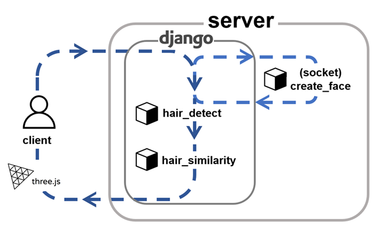
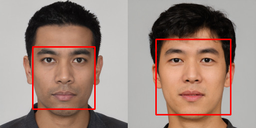
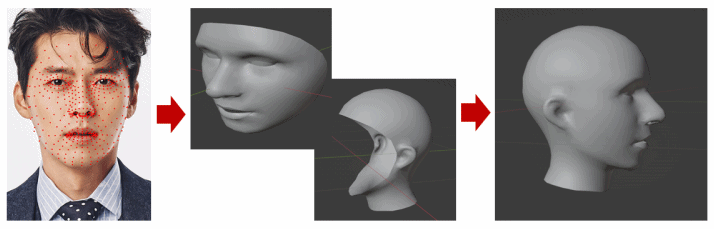
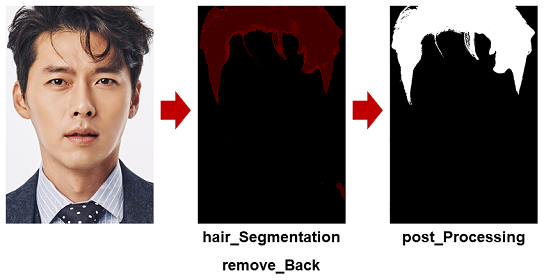
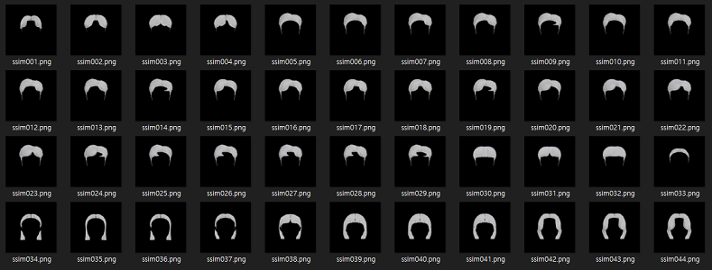
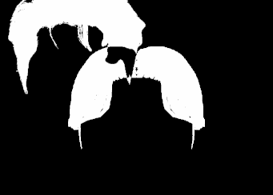
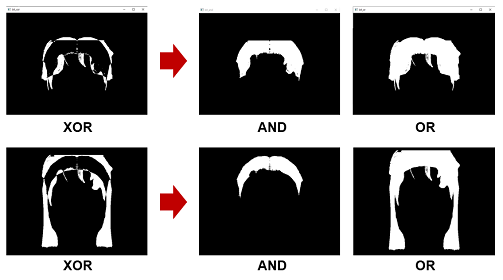
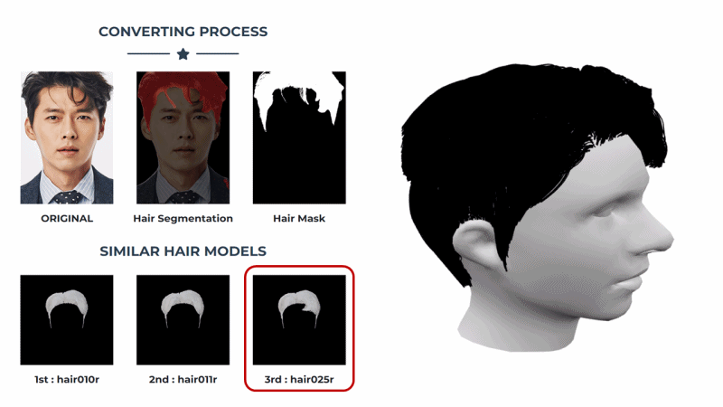

# Face_Converter
졸업작품 - 자유주제

<a href = "https://www.kci.go.kr/kciportal/ci/sereArticleSearch/ciSereArtiView.kci?sereArticleSearchBean.artiId=ART003021056">논문</a>

# <소개>
  - 2차원 인물 이미지를 3차원 이미지로 변환해주는 프로젝트
  - Django를 활용한 웹-클라이언트 시스템
  - 얼굴에 대한 3D 모델은 직접생성, 헤어에 대한 3D 모델은 라이브러리 매칭(44개 종류의 헤어모델)

 ## 시스템 흐름
  
  
  1) 이미지를 필터링
  2) 3D 얼굴 이미지 생성 : create_face
  3) 헤어 영역 추출 : hair_detect
  4) 유사한 헤어 매칭 : hair_similarity
  5) 합치기 및 출력
  
  ### 1. 이미지 필터링
  
  
  - 얼굴 인식 라이브러리 dlib 활용하여 이미지속 인물이 1명이 아닌경우 필터링

  ### 2. create_face : 3D 얼굴 이미지 생성
  
  
  
  - 얼굴 인식 라이브러리 Mediapipe 의 face_mesh 활용하여 얼굴의 468개의 랜드마크 생성
  - 3D 그래픽 블렌더 조작 라이브러리 bpy 활용하여 468개의 랜드마크 기반으로 안면 3D 객체 생성
  - 안면 3D 객체와 두상 3D 모델 연결

  ### 3. hair_detect : 헤어 영역 추출
  
  
  
  
  - hair_Segmentation : hair tenseorflow, Keras 기반 DeepLabV3+ 활용하여 헤어 영역 검출

    - 인공지능 학습 후 사용
    
  - remove_Back : Pythorch 기반 DeepLabV3 활용하여 배경제거
  
    - 배경에 대한 노이즈 제거하기 위함
    
  - post_Processing : opencv의 threshold, Contour 활용하여 노이즈 제거
  
    - 이미지 이진화 진행 후, 컨투어로 모든 영역을 탐색
    - 가장 큰 영역을 기준으로 일정 퍼센트 이상 영역을 헤어로 간주하고 다른 영역 제거 

  ### 4. hair_similarity : 유사한 헤어 매칭
  
  - opencv의 이미지 처리, bitwise 연산, MSE(평균제곱오차) 활용하여 헤어영역의 유사도 측정
  - 제작된 3D 헤어 모델의 정면 이미지 와 사용자의 헤어 영역을 비교(44개의 헤어모델, 좌우반전포함시 74개)
  
  
  
  <a href = "https://github.com/kkhdss165/-graduation_work-Face_Converter/blob/main/report/hair_model_list.jpg">헤어모델리스트</a>
 
 
  ### 매칭 과정
   base image : 사용자 헤어 영역, compare image : 3D 헤어모델 정면 이미지 모음 중 일부 
   
   1) compare image와 base image를 비율을 유지하면서 너비의 같은 길이로 조정.
   2) 이후 compare image를 큰 검정 컨버스 중심으로 두고 base image는 또 다른 같은 크기의 검정 컨버스의 좌측 상단에 배치.
   
   
   
   3) base image는 정해진 픽셀 수만큼 우측으로 이동하면서 compare image와 base image에 대하여 bitwise_xor 연산을 수행한다.
    
   - 우측 끝에 도달할 때 까지 반복, 좌표 값에 따른 bitwise_xor을 기록
   - bitwise_xor 값이 가장 낮을때를 찾기(가장 많이 겹치는 지점)
   
   4) 모든 compare image 이미지에 1) ~ 3) 반복

   
   
   5) 모든 compare image 에 대해서 가장 많이 겹치는 시점에서 bitwise_or 와 bitwise_and 연산 수행
   6) bitwise_or 와 bitwise_and 값의 차이가 가장 적은 compare image 찾기
   
   - base image 와 compare image 가 유사할 수록 bitwise_or 와 bitwise_and 차이가 작음
   

  ### 5. 합치기 및 출력

  - create_face 통해 생성된 모델에 맞게 헤어 모델 사이즈 및 좌표 조정
  - THREE.js 활용하여 웹 클라이언트에 3D 객체 출력
  

  
  

  
  ## 어려웠던점
   - bpy를 활용한 create_face모듈 Django 내부에서 정상작동X >> 소켓 프로그래밍 활용하여 문제 해결
  
## <개발환경>
- IDE : PyCharm
- Etc : Blender(3D)

## <개발기간>
- 2022년 학기중 (6개월)

## <참조>
- <a href = "https://github.com/kkhdss165/-graduation_work-Face_Converter/blob/main/report/dev_report.pdf">개발보고서</a>
- <a href = "https://github.com/kkhdss165/-graduation_work-Face_Converter/blob/main/report/pamphlet.png">팜플릿</a>
- <a href = "https://github.com/kkhdss165/-study_practice-Graduation_Work">연구, 연습, 메모</a>
- <a href = "https://github.com/kkhdss165/-graduation_work-Face_Converter/blob/main/report/hair_model_list.jpg">헤어모델리스트</a>
- <a href = "https://www.kci.go.kr/kciportal/ci/sereArticleSearch/ciSereArtiView.kci?sereArticleSearchBean.artiId=ART003021056">논문(KCI)</a>
- <a href = "http://www.ijibc.org/pop/ijibc/sub05.php">A Study on a Method for Generating a 3D Head Model from a Single 2D Face Image Using Open Source(IJIBC)</a>
